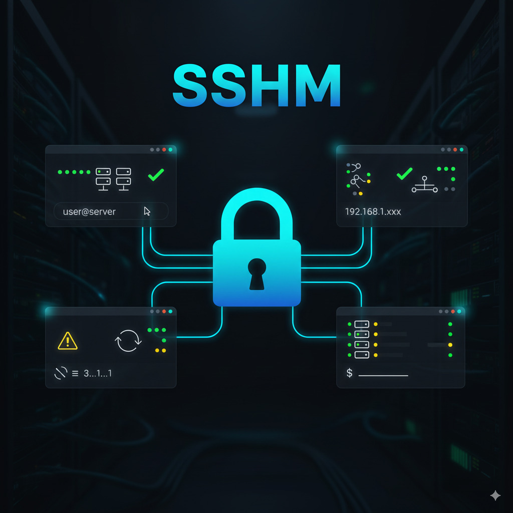

# SSHM - SSH Connection Manager

<div align="center">



[](https://github.com/idabic/sshm/actions)
[](https://goreportcard.com/report/github.com/idabic/sshm)
[](https://opensource.org/licenses/MIT)
[](https://golang.org/)

**Enterprise-grade SSH connection manager with integrated tmux sessions and intuitive TUI**

*Eliminate connection chaos. Scale your infrastructure management.*

[Installation](#installation) • [Quick Start](#quick-start) • [Features](#key-capabilities) • [Documentation](#command-reference)

---

</div>

## Overview

SSHM is a professional SSH connection manager designed for DevOps teams managing complex infrastructure. It combines organized server management, persistent tmux sessions, and a k9s-inspired terminal interface to eliminate connection overhead and improve operational efficiency.

**Key Benefits:**
- **Visual Management** - TUI interface for browsing and organizing servers
- **Session Persistence** - tmux integration with intelligent session handling  
- **Enterprise Security** - Encrypted credential storage with multiple auth methods
- **Team Workflows** - Profile-based organization and configuration sharing

---

## Installation

### Go Install (Recommended)
```bash
go install github.com/igda-igda/sshm@latest
```

### Build from Source
```bash
git clone https://github.com/igda-igda/sshm.git
cd sshm && go build -ldflags="-s -w" -o sshm main.go
sudo mv sshm /usr/local/bin/
```

### Binary Releases
Pre-built binaries available for Linux, macOS, and Windows (coming soon).

**Requirements:** tmux, SSH client

---

## Quick Start

### 1. Launch TUI
```bash
sshm tui
```

### 2. Add Servers
```bash
# Interactive setup
sshm add production-web

# Direct configuration
sshm add prod-api \
  --hostname api.prod.com \
  --username deploy \
  --auth-type key \
  --key-path ~/.ssh/prod_key
```

### 3. Organize with Profiles
```bash
sshm profile create production
sshm profile assign prod-web production
sshm profile assign prod-api production
```

### 4. Connect
```bash
# Single server
sshm connect prod-web

# Group connection (multiple windows)
sshm batch --profile production
```

---

## Key Capabilities

### TUI Interface
- **Visual Navigation** - Arrow keys, search (`/`), quick actions (`a`, `e`, `d`)
- **Multi-Panel Layout** - Servers, profiles, sessions, history
- **Real-time Monitoring** - Connection status and session health
- **Keyboard Shortcuts** - Full control without mouse interaction

### Session Management  
- **Intelligent tmux Integration** - Automatic session creation and naming
- **Single Server Mode** - Dedicated sessions per server
- **Group Mode** - One session with multiple windows per profile
- **Persistence** - Sessions survive network interruptions

### Security & Authentication
- **Multiple Methods** - SSH keys, passwords, SSH agent
- **Encrypted Storage** - System keyring integration
- **Connection History** - Track usage patterns and diagnostics
- **Secure Input** - Hidden credential prompts

### Team Collaboration
- **Profile Organization** - Environment-based grouping (dev/staging/prod)
- **Configuration Export** - YAML/JSON sharing between teams  
- **Import Support** - SSH config and team configurations
- **Batch Operations** - Simultaneous environment connections

---

## Architecture

### Session Design
```
Single Connection                Group Connection
┌─────────────────────┐         ┌─────────────────────────────┐
│ tmux: "prod-web"    │         │ tmux: "production"          │
│ ┌─────────────────┐ │         │ ┌─────┐ ┌─────┐ ┌─────┐     │
│ │   SSH Session   │ │         │ │ web │ │ api │ │ db  │     │
│ └─────────────────┘ │         │ └─────┘ └─────┘ └─────┘     │
└─────────────────────┘         └─────────────────────────────┘
```

### Security Model
- **Local Configuration** - `~/.sshm/` with restricted permissions
- **Credential Encryption** - System keyring for sensitive data
- **Zero Password Storage** - Authentication preferences only
- **SSH Key References** - File paths, never private key content

---

## Command Reference

### Core Operations
```bash
sshm tui                         # Launch TUI interface
sshm add <name> [flags]         # Add server
sshm list [--profile <name>]    # List servers
sshm connect <name>             # Single connection
sshm batch --profile <name>     # Group connection
sshm remove <name>              # Remove server
```

### Profile Management
```bash
sshm profile create <name>      # Create profile
sshm profile list               # List profiles
sshm profile assign <server> <profile>  # Assign server
sshm profile delete <name>      # Delete profile
```

### Session Control
```bash
sshm sessions list              # Active sessions
sshm sessions kill <name>       # Kill session
sshm history [--days N]         # Connection history
```

### Configuration
```bash
sshm import <file>              # Import configuration
sshm export <file> [--profile <name>]  # Export configuration
sshm export <file> --format json       # Export as JSON
```

---

## Development

### Testing
```bash
go test ./...                   # Run all tests
go test -cover ./...           # With coverage
```

### Building
```bash
# Cross-platform builds
GOOS=linux GOARCH=amd64 go build -o sshm-linux-amd64 main.go
GOOS=darwin GOARCH=arm64 go build -o sshm-darwin-arm64 main.go
GOOS=windows GOARCH=amd64 go build -o sshm-windows.exe main.go
```

---

## Project Status

| Component | Status | Notes |
|-----------|--------|-------|
| **Core SSH Management** | ✅ Complete | tmux integration, authentication |
| **Profile Organization** | ✅ Complete | Batch operations, import/export |
| **TUI Interface** | ✅ Complete | k9s-inspired design |
| **Advanced Security** | 🔄 In Progress | Enhanced encryption, keyring |
| **Cloud Integration** | 📋 Planned | AWS/GCP/Azure discovery |

**Current Version:** v1.4.0 • **Status:** Production Ready

---

## Contributing

1. Fork repository
2. Create feature branch (`feature/new-capability`)
3. Add tests for changes
4. Ensure `go test ./...` passes
5. Submit pull request

**Guidelines:** Follow Go conventions, maintain test coverage, update documentation.

---

## License

MIT License - see [LICENSE](LICENSE) file.

---

<div align="center">

**Built for DevOps teams managing complex infrastructure at scale.**

</div>